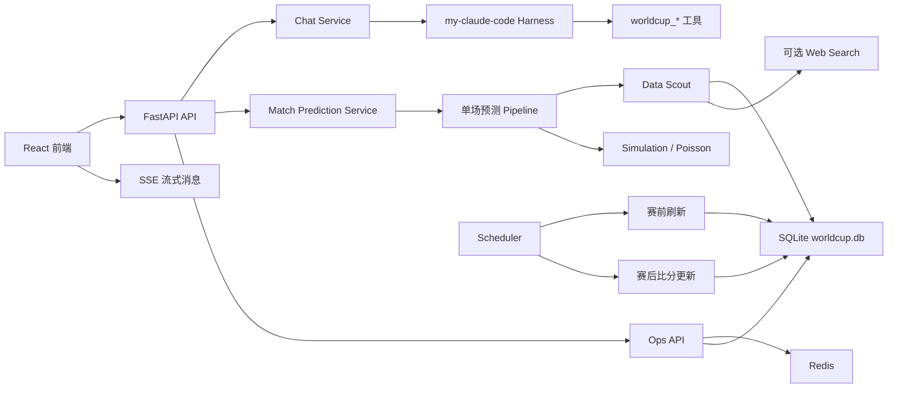

# WorldCup Champion Agent · 世界杯冠军预测 Agent

> 赛程驱动的 2026 世界杯单场预测与数据查询 Agent 系统。


本系统以 **SQLite 真实赛程数据库**为核心，以 **`my-claude-code` harness** 为主 Agent 编排层，以**前端流式对话和赛程页**为主要交互入口。它支持数据库查询、单场预测、赛前信息刷新、赛后比分搜索更新、Redis 检查点缓存、定时任务调度和运维接口。

---

## 目录

- [功能亮点](#功能亮点)
- [技术栈](#技术栈)
- [项目结构](#项目结构)
- [架构简图](#架构简图)
- [数据库说明](#数据库说明)
- [快速开始](#快速开始)
  - [环境要求](#环境要求)
  - [1. 克隆项目](#1-克隆项目)
  - [2. 启动后端](#2-启动后端)
  - [3. 启动前端](#3-启动前端)
  - [4. 可选：启动 Redis](#4-可选启动-redis)
- [配置说明](#配置说明)
- [常用接口](#常用接口)
- [更多文档](#更多文档)
- [注意事项](#注意事项)

---

## 功能亮点

- 按北京时间展示 2026 世界杯赛程，已完赛场次显示 SQLite 中的真实比分。
- **单场比赛预测工作流**：数据搜查 → 球队分析 → 比分模拟 → 解释生成 → 结果保存。
- **Chat Agent** 支持 SSE 流式输出，回答逐块显示在前端。
- `my-claude-code` harness 作为主 Agent，可调用 `worldcup_*` 业务工具。
- **Data Scout** 支持 SQLite 数据库检索，并可在配置搜索 Key 后联网搜索。
- **定时调度**：赛前 30 分钟刷新比赛信息，开赛 3 小时后搜索并写回比分。
- **检查点机制**：Redis + SQLite 支持缓存、分布式锁、任务去重与失败恢复。
- **运维接口**：Redis 健康检查、调度器扫描、检查点恢复、数据库备份/恢复、Text2SQL 查询。

## 技术栈

| 层级 | 技术 |
| --- | --- |
| 前端 | React · TypeScript · Vite · Ant Design |
| 后端 | FastAPI · SSE · Pydantic |
| Agent 编排 | `my-claude-code` harness · 单场预测 Pipeline |
| 数据库 | SQLite · FTS5 · WAL · 索引优化 |
| 缓存 / 锁 | Redis（可选启用） |
| 调度 | 后端内置 asyncio scheduler |
| 搜索 | SQLite 全文检索；可选 Bocha Web Search |
| LLM | OpenAI 兼容接口，默认关闭，可配置 Qwen / DashScope |

## 项目结构

```text
worldcup-predict-agent-master/
└─ worldcup-champion-agent/       # 主体项目
   ├─ backend/                    # FastAPI 后端
   ├─ frontend/                   # React + Vite 前端
   ├─ data/                       # SQLite 数据库、schema、备份、预测快照
   ├─ datasets/                   # CSV 静态数据源
   ├─ data_agent/                 # 协作者数据接入与标准化模块
   ├─ scripts/                    # 数据构建、校验、导入脚本
   └─ docker-compose.redis.yml    # 本地 Redis 容器配置
```

## 架构简图



## 数据库说明

项目主数据源为 `worldcup-champion-agent/data/worldcup.db`（SQLite，WAL 模式，已随仓库提供），由 [`data/database.py`](worldcup-champion-agent/data/database.py) 中的 `init_db()` 建表，并启用 FTS5 全文检索。克隆后即可直接使用，无需初始化。

> 说明：`backend/app/db/schema.sql` 是一份面向 PostgreSQL 的扩展设计稿（含情报快照、预测运行等表），并非当前 `worldcup.db` 的运行结构，二者请勿混淆。

### 内容概览

| 指标 | 数量 |
| --- | --- |
| 球队 `teams` | 48 |
| 球员 `members` | 528 |
| 比赛 `matches` | 102（已确定比分 100 场，待赛 2 场） |
| 阶段分布 `stage` | 小组赛 88 · 淘汰赛 8 + 4 + 2 |

### 核心表结构

**`teams` — 球队维度**

| 字段 | 类型 | 说明 |
| --- | --- | --- |
| `name` | TEXT | 球队名称，唯一 |
| `group` | TEXT | 所在小组 |
| `attack_team` / `defensive_team` | REAL | 球队攻防系数，默认 1.0 |
| `streak` | INTEGER | 近期连胜/势头 |
| `starting_lineup` | TEXT | 首发阵容（JSON 数组字符串） |
| `fifa_ranking` | INTEGER | FIFA 排名 |

**`members` — 球员**

| 字段 | 类型 | 说明 |
| --- | --- | --- |
| `name` | TEXT | 球员姓名 |
| `team_name` | TEXT | 所属球队（外键 → `teams.name`） |
| `attack` / `defensive` | REAL | 球员攻/防评分 |
| `injured` | INTEGER | 是否伤停：0 否 / 1 是 |
| `injury_description` | TEXT | 伤情说明 |

**`matches` — 赛程与比分**

| 字段 | 类型 | 说明 |
| --- | --- | --- |
| `match_id` | TEXT | 场次唯一标识，如 `s1_mexico_south_africa` |
| `stage` | INTEGER | 阶段：1=小组赛，2 及以上为淘汰赛各轮 |
| `home_team` / `away_team` | TEXT | 主 / 客队 |
| `home_score` / `away_score` | INTEGER | 比分，`-1` 表示尚未开赛 |
| `is_real` | BOOLEAN | 是否为真实比分 |
| `played_at` | TEXT | 比赛时间（ISO 8601 UTC） |

### 运行时 / 运维表

| 表 | 用途 |
| --- | --- |
| `pre_match_updates` | 赛前信息刷新记录（阵容、伤病、新闻等） |
| `post_match_results` | 赛后比分搜索、解析与回写结果 |
| `knowledge_documents` (+ `_fts`) | 知识文档及 FTS5 全文检索索引 |
| `app_checkpoints` | 定时任务检查点（缓存、去重、失败恢复） |
| `db_maintenance_log` | 数据库备份/恢复/优化等维护日志 |

## 快速开始

### 环境要求

- Python 3.12+
- Node.js 18+
- Docker（可选，仅用于本地 Redis）

### 1. 克隆项目

```bash
git clone <your-repo-url>
cd worldcup-predict-agent-master/worldcup-champion-agent
```

### 2. 启动后端

```powershell
cd backend

# 创建并激活虚拟环境
python -m venv .venv
.\.venv\Scripts\Activate.ps1        # Windows PowerShell
# source .venv/bin/activate         # macOS / Linux

# 安装依赖
pip install -r requirements.txt

# 准备环境变量（首次运行）
copy .env.example .env              # Windows
# cp .env.example .env              # macOS / Linux

# 启动服务
python -m uvicorn main:app --host 127.0.0.1 --port 8001
```

### 3. 启动前端

```powershell
cd frontend
npm install
npm run dev -- --host 127.0.0.1 --port 5173
```

访问地址：

- 前端主页：http://127.0.0.1:5173/home
- 赛程页：http://127.0.0.1:5173/schedule
- 后端健康检查：http://127.0.0.1:8001/api/health

> 数据库文件 `data/worldcup.db` 已随仓库提供，克隆后可直接使用真实赛程数据，无需额外初始化。

### 4. 可选：启动 Redis

本地开发推荐用 Docker 启动 Redis：

```powershell
cd worldcup-champion-agent
docker compose -f docker-compose.redis.yml up -d
docker exec worldcup-agent-redis redis-cli ping   # 返回 PONG 即成功
```

不使用 Redis 时，在 `backend/.env` 中设置 `REDIS_ENABLED=false` 即可，检查点仍会持久化到 SQLite。

## 配置说明

后端读取 `backend/.env`（首次需从 `.env.example` 复制）。常用配置：

```env
# LLM（默认关闭，关闭时优先使用本地规则和确定性逻辑）
LLM_ENABLED=false
LLM_API_KEY=
LLM_BASE_URL=https://dashscope.aliyuncs.com/compatible-mode/v1
LLM_MODEL=qwen-plus

# Agent Harness 与联网搜索
MY_CLAUDE_RUNTIME_ENABLED=true
BOCHA_API_KEY=                      # 配置后 Data Scout / 赛后刷新可联网搜索

# 定时调度
SCHEDULER_ENABLED=true
PRE_MATCH_UPDATE_MINUTES=30         # 赛前 30 分钟刷新信息
POST_MATCH_RESULT_HOURS=3           # 开赛 3 小时后搜索比分

# Redis
REDIS_ENABLED=true
REDIS_URL=redis://localhost:6379/0
REDIS_KEY_PREFIX=worldcup-agent
```

> `.env` 已被 `.gitignore` 忽略，不会上传，请勿在其中提交真实密钥。

## 常用接口

| 方法 | 路径 | 说明 |
| --- | --- | --- |
| `GET` | `/api/health` | 健康检查 |
| `GET` | `/api/teams` | 球队列表 |
| `GET` | `/api/matches/schedule` | 赛程 |
| `POST` | `/api/matches/{match_id}/predict` | 单场预测 |
| `POST` | `/api/chat/sessions` | 创建 Chat 会话 |
| `GET` | `/api/chat/sessions/{session_id}/stream` | SSE 流式对话 |
| `GET` | `/api/data/search?q=...` | 数据检索 |
| `GET` | `/api/ops/redis/health` | Redis 健康检查 |
| `GET` | `/api/ops/scheduler/status` | 调度器状态 |
| `POST` | `/api/ops/database/backup?label=manual` | 数据库备份 |
| `POST` | `/api/ops/text2sql/query` | Text2SQL 查询 |

## 更多文档

完整的项目说明（详细目录、数据流、Agent 工具清单、检查点机制、全部 API 等）见：

- [`worldcup-champion-agent/README.md`](worldcup-champion-agent/README.md)

## 注意事项

- 项目主数据源是 `worldcup-champion-agent/data/worldcup.db`，不再回退旧 demo 赛制规则。
- 新数据出错时应直接暴露错误，避免静默回退导致前端展示不一致。
- 赛后比分自动更新依赖联网搜索配置；未配置 `BOCHA_API_KEY` 时会记录失败检查点，等待后续重试。
- 在 PowerShell 中直接显示部分中文文件时可能出现乱码，这是终端编码显示问题，文件本身按 UTF-8 读写。
