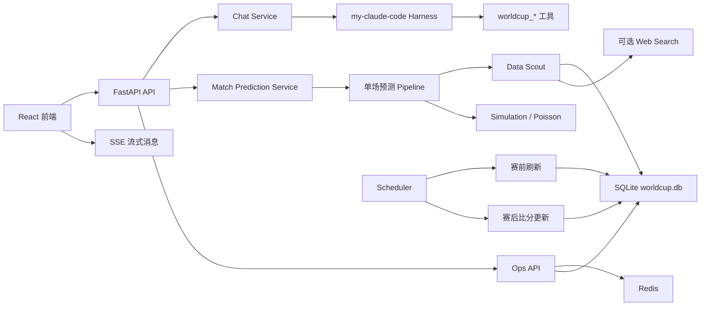

# WorldCup Agent

本仓库当前主体项目位于 `worldcup-champion-agent/`，是一个赛程驱动的世界杯单场预测与数据查询 Agent 系统。

系统已经从早期 demo 预测项目调整为以 SQLite 真实赛程数据库为核心、以 `my-claude-code` harness 为主 Agent 编排层、以前端流式对话和赛程页为主要交互入口的应用。它支持数据库查询、单场预测、赛前信息刷新、赛后比分搜索更新、Redis 检查点缓存、定时任务调度和运维接口。

## 项目入口

```text
worldcup-champion-agent/
  backend/                    # FastAPI 后端
  frontend/                   # React + Vite 前端
  data/                       # SQLite 数据库、schema、备份、预测快照
  datasets/                   # CSV 静态数据源
  data_agent/                 # 协作者数据接入与标准化模块
  scripts/                    # 数据构建、校验、导入脚本
  docker-compose.redis.yml    # 本地 Redis 容器配置
```

## 核心技术

| 层级 | 技术 |
| --- | --- |
| 前端 | React, TypeScript, Vite, Ant Design |
| 后端 | FastAPI, SSE, Pydantic |
| Agent 编排 | `my-claude-code` harness, 单场预测 Pipeline |
| 数据库 | SQLite, FTS5, WAL, 索引优化 |
| 缓存/锁 | Redis，可选启用 |
| 调度 | 后端内置 asyncio scheduler |
| 搜索 | SQLite 检索；可选 Bocha Web Search |
| LLM | OpenAI-compatible 接口，默认关闭，可配置 Qwen/DashScope |

## 核心能力

- 按北京时间展示 2026 世界杯赛程。
- 已完赛场次展示 SQLite 中的真实比分。
- 单场比赛预测：数据搜查、球队分析、比分模拟、解释生成、结果保存。
- Chat Agent 支持 SSE 流式输出。
- Harness 主 Agent 可调用 `worldcup_*` 业务工具。
- Data Scout 支持数据库检索和可选联网搜索。
- 赛前 30 分钟定时刷新比赛信息。
- 比赛开始 3 小时后定时搜索比分结果并写回数据库。
- Redis + SQLite 检查点机制支持缓存、锁、任务去重和失败恢复。
- 运维接口支持 Redis 健康检查、调度器扫描、检查点恢复、数据库备份/恢复、Text2SQL 查询。

## 架构简图



## 快速启动

后端：

```powershell
cd C:\Users\SJY\Desktop\worldcup-predict-agent-master\worldcup-champion-agent\backend
.venv\Scripts\python.exe -m uvicorn main:app --host 127.0.0.1 --port 8001
```

前端：

```powershell
cd C:\Users\SJY\Desktop\worldcup-predict-agent-master\worldcup-champion-agent\frontend
npm install
npm run dev -- --host 127.0.0.1 --port 5173
```

访问：

- 前端主页：http://127.0.0.1:5173/home
- 赛程页：http://127.0.0.1:5173/schedule
- 后端健康检查：http://127.0.0.1:8001/api/health

## Redis

本地开发推荐用 Docker 启动 Redis：

```powershell
cd C:\Users\SJY\Desktop\worldcup-predict-agent-master\worldcup-champion-agent
docker compose -f docker-compose.redis.yml up -d
docker exec worldcup-agent-redis redis-cli ping
```

`backend/.env` 中的 Redis 配置：

```env
REDIS_ENABLED=true
REDIS_URL=redis://localhost:6379/0
REDIS_KEY_PREFIX=worldcup-agent
REDIS_DEFAULT_TTL_SECONDS=900
CHECKPOINT_TTL_SECONDS=86400
CHECKPOINT_RUNNING_TIMEOUT_SECONDS=1800
```

如果暂时不用 Redis，可设置：

```env
REDIS_ENABLED=false
```

检查点仍会持久化到 SQLite。

## 常用接口

- `GET /api/health`
- `GET /api/teams`
- `GET /api/matches/schedule`
- `POST /api/matches/{match_id}/predict`
- `POST /api/chat/sessions`
- `GET /api/chat/sessions/{session_id}/stream`
- `GET /api/data/search?q=...`
- `GET /api/ops/redis/health`
- `GET /api/ops/scheduler/status`
- `POST /api/ops/scheduler/scan?force=false`
- `GET /api/ops/checkpoints`
- `POST /api/ops/checkpoints/recover-stale`
- `POST /api/ops/database/backup?label=manual`
- `POST /api/ops/text2sql/query`

## 更多说明

完整项目说明位于：

```text
worldcup-champion-agent/README.md
```

当前项目主数据源是 `worldcup-champion-agent/data/worldcup.db`，不再回退旧 demo 赛制规则；新数据出错时应直接暴露错误，避免静默回退造成前端展示不一致。
