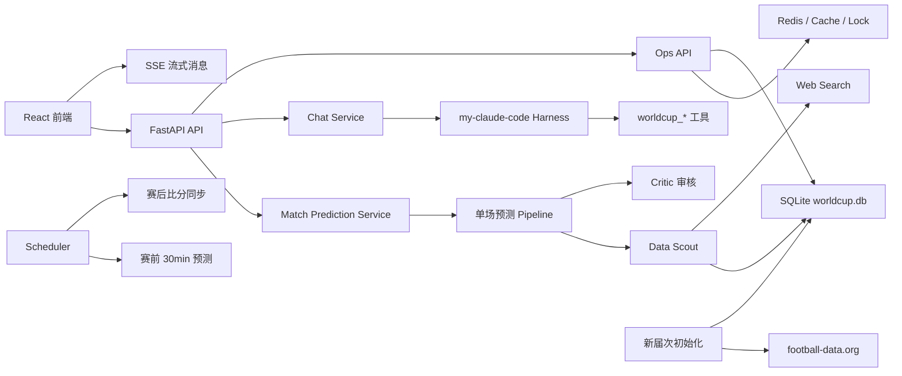

# WorldCup Agent

一个陪你实时追随世界杯的赛程驱动单场预测系统。项目以 SQLite 赛事数据库为核心，以 FastAPI 提供后端能力，以 React 前端展示赛程、球队、排名、淘汰赛和 Chat Agent，并通过 `my-claude-code` harness 组织 Agent 工具调用。


## 核心能力

- 世界杯赛程页：按北京时间展示比赛日，日期卡片显示阶段、场次数和完赛状态。
- 球队信息页：展示球队基础实力、阵容、球员评分、伤病和首发信息。
- 小组赛分组及排名：根据真实比分自动计算积分、净胜球，并展示最好的小组第三排名。
- 淘汰赛晋级图：按阶段切换展示对阵图，未确定对阵保留“待定”节点，已完赛显示比分。
- 单场预测工作流：数据搜查、球队分析、比分模拟、解释生成、审核和结果保存。
- Chat Agent：支持流式对话、实时搜索开关、思考节点展示和信息来源追溯。
- 赛前自动预测：后台调度器可在赛前 30 分钟结合实时信息生成并覆盖预测结果。
- 赛后比分同步：比赛开始后约 3 小时周期搜索真实比分并写回数据库。
- 多届世界杯初始化：通过前端按钮初始化新一届世界杯，按 `season` 隔离数据，不硬覆盖旧数据。
- 运维能力：Redis 健康检查、缓存清理、调度器扫描、数据库备份恢复、Text2SQL 查询。

## 技术栈

| 层级 | 技术 |
| --- | --- |
| 前端 | React, TypeScript, Vite, Ant Design |
| 后端 | FastAPI, Pydantic, SSE |
| Agent 编排 | `my-claude-code` harness, 单场预测 Pipeline |
| 数据库 | SQLite, WAL, FTS5, 索引优化 |
| 缓存 / 锁 | Redis 可选；未启用时回退内存 + SQLite 检查点 |
| 调度 | 后端内置 asyncio scheduler |
| 外部数据 | football-data.org, Bocha Web Search |
| LLM | OpenAI-compatible 接口，可配置 Qwen / DashScope，默认关闭 |

## 项目结构

```text
worldcup-predict-agent-master/
└─ worldcup-champion-agent/
   ├─ backend/                    # FastAPI 后端
   │  ├─ app/api/                 # REST / SSE / Ops 路由
   │  ├─ app/harness/             # my-claude-code harness 集成
   │  └─ app/services/            # 预测、搜索、调度、缓存、初始化等服务
   ├─ frontend/                   # React + Vite 前端
   ├─ data/                       # SQLite 数据库、备份、预测快照
   ├─ data_agent/                 # 外部数据源接入与标准化
   ├─ datasets/                   # 静态 CSV 数据源
   ├─ scripts/                    # 数据构建、校验、导入脚本
   └─ docker-compose.redis.yml    # 本地 Redis 配置
```

## 架构概览



## 数据库与多届世界杯

主数据库位于：

```text
worldcup-champion-agent/data/worldcup.db
```

当前数据库结构以现有字段为基础，并增加了届次隔离能力：

| 表 / 字段 | 作用 |
| --- | --- |
| `worldcup_seasons` | 记录不同世界杯年份，标记当前 active season |
| `matches.season` | 比赛所属年份，避免新旧届次互相覆盖 |
| `matches.source_match_id` | 外部数据源比赛 ID，用于赛果同步精确匹配 |
| `team_season_profiles` | 某届世界杯下球队分组和评分快照 |
| `app_checkpoints` | 调度任务、搜索任务、预测任务的检查点 |
| `pre_match_updates` | 赛前情报刷新记录 |
| `post_match_results` | 赛后比分搜索、解析和写回记录 |
| `knowledge_documents` | 情报文档和 FTS5 全文检索数据 |

前端和后端默认读取 `worldcup_seasons.is_active = 1` 的届次。点击“初始化并开启新一届世界杯”后，系统会新增新赛季数据并切换 active season，不删除旧数据。

## 快速启动

### 后端

```powershell
cd C:\Users\SJY\Desktop\worldcup-predict-agent-master\worldcup-champion-agent\backend

# 首次运行
python -m venv .venv
.\.venv\Scripts\Activate.ps1
pip install -r requirements.txt
copy .env.example .env

# 启动
.\.venv\Scripts\python.exe -m uvicorn main:app --host 127.0.0.1 --port 8001
```

### 前端

```powershell
cd C:\Users\SJY\Desktop\worldcup-predict-agent-master\worldcup-champion-agent\frontend

npm install
npm run dev -- --host 127.0.0.1 --port 5173
```

访问：

- 前端主页：http://127.0.0.1:5173/home
- 赛程页：http://127.0.0.1:5173/schedule
- 后端健康检查：http://127.0.0.1:8001/api/health

> Windows 下如果 Vite 报 `spawn EPERM`，通常是 esbuild 子进程被当前受限终端拦截。可以用外部终端或提升权限方式启动前端。

## Redis 配置

Redis 是可选能力，用于缓存、锁和检查点加速。没有 Redis 时，系统仍可使用 SQLite 持久化检查点。

```powershell
cd C:\Users\SJY\Desktop\worldcup-predict-agent-master\worldcup-champion-agent
docker compose -f docker-compose.redis.yml up -d
docker exec worldcup-agent-redis redis-cli ping
```

`backend/.env` 推荐配置：

```env
REDIS_ENABLED=true
REDIS_URL=redis://localhost:6379/0
REDIS_KEY_PREFIX=worldcup-agent
REDIS_DEFAULT_TTL_SECONDS=900
CHECKPOINT_TTL_SECONDS=86400
CHECKPOINT_RUNNING_TIMEOUT_SECONDS=1800
```

不使用 Redis：

```env
REDIS_ENABLED=false
```

## 外部数据与 Key

后端密钥只放在 `worldcup-champion-agent/backend/.env`，不要写入前端。

```env
# 官方足球数据，负责赛程和比分同步
FOOTBALL_DATA_API_KEY=
FOOTBALL_DATA_SEASON=2026
LIVE_SCORE_SYNC_ENABLED=true
LIVE_SCORE_SYNC_INTERVAL_SECONDS=300

# 联网搜索，负责新闻、赛前情报、赛后比分补充
BOCHA_API_KEY=

# LLM，可选
LLM_ENABLED=false
LLM_API_KEY=
LLM_BASE_URL=https://dashscope.aliyuncs.com/compatible-mode/v1
LLM_MODEL=qwen-plus
```

## 新一届世界杯初始化

前端入口：

```text
世界杯赛程表 -> 初始化并开启新一届世界杯
```

流程：

1. 用户点击按钮。
2. 系统提示确认：不会删除旧数据，但会新增并可切换当前启用届次。
3. 用户填写世界杯年份和初始化选项。
4. 后端调用 football-data.org 拉取赛程。
5. 系统写入新 `season` 的比赛、球队基础数据和淘汰赛待定占位。
6. 校验阶段、分组、场次数，并返回 warnings。
7. 若选择启用，则设置为 active season，前端自动读取新届次。

相关接口：

| 方法 | 路径 | 说明 |
| --- | --- | --- |
| `GET` | `/api/ops/worldcup/seasons` | 查看所有届次和当前 active season |
| `POST` | `/api/ops/worldcup/initialize` | 初始化新一届世界杯 |

示例请求：

```json
{
  "season": 2030,
  "activate": true,
  "sync_football_data": true,
  "bootstrap_teams": true,
  "init_knockout_placeholders": true
}
```

## 调度机制

后台调度器由后端启动时自动运行：

- `SCHEDULER_ENABLED=true`
- 每 `SCHEDULER_POLL_SECONDS` 秒扫描一次。
- 赛前 `PRE_MATCH_UPDATE_MINUTES` 分钟刷新情报。
- `PRE_MATCH_AUTO_PREDICT=true` 时，赛前窗口内自动生成并覆盖预测结果。
- 比赛开始 `POST_MATCH_RESULT_HOURS` 小时后搜索真实比分并写回数据库。
- 所有任务通过 Redis/SQLite 检查点防重、恢复和重试。

常用配置：

```env
SCHEDULER_ENABLED=true
SCHEDULER_POLL_SECONDS=60
PRE_MATCH_UPDATE_MINUTES=30
PRE_MATCH_INCLUDE_WEB=true
PRE_MATCH_AUTO_PREDICT=true
POST_MATCH_RESULT_HOURS=3
POST_MATCH_INCLUDE_WEB=true
```

## 主要页面

| 页面 | 路径 | 说明 |
| --- | --- | --- |
| 主页 | `/home` | 系统介绍和世界杯视频 |
| 世界杯赛程表 | `/schedule` | 日期、阶段、比赛日、初始化新届次 |
| 球队信息 | `/teams` | 球队、阵容、评分、伤病 |
| 小组赛分组及排名 | `/groups` | 小组积分榜和小组第三排名 |
| 淘汰赛晋级树 | `/knockout` | 按阶段切换的淘汰赛对阵图 |
| 比赛结果概览 | `/results` | 已完赛比分和已保存预测 |
| Chat Agent | 右下角按钮 | 流式对话、实时搜索、来源追溯 |

## 主要 API

| 方法 | 路径 | 说明 |
| --- | --- | --- |
| `GET` | `/api/health` | 健康检查 |
| `GET` | `/api/teams` | active season 球队列表 |
| `GET` | `/api/matches` | active season 比赛列表 |
| `GET` | `/api/matches/schedule` | active season 赛程聚合 |
| `POST` | `/api/matches/{match_id}/predict` | 单场预测并保存 |
| `POST` | `/api/chat/sessions` | 创建 Chat 会话 |
| `POST` | `/api/chat/sessions/{session_id}/messages` | 发送 Chat 消息 |
| `GET` | `/api/chat/sessions/{session_id}/stream` | SSE 流式对话 |
| `GET` | `/api/data/search` | 数据库/联网检索 |
| `GET` | `/api/ops/scheduler/status` | 调度器状态 |
| `POST` | `/api/ops/scheduler/scan` | 手动扫描调度任务 |
| `POST` | `/api/ops/live-sync` | 手动同步官方比分 |
| `GET` | `/api/ops/redis/health` | Redis 健康检查 |
| `POST` | `/api/ops/database/backup` | 数据库备份 |
| `POST` | `/api/ops/database/restore` | 数据库恢复 |
| `POST` | `/api/ops/text2sql/query` | 安全 Text2SQL 查询 |

## 验证命令

后端编译检查：

```powershell
cd C:\Users\SJY\Desktop\worldcup-predict-agent-master\worldcup-champion-agent\backend
.\.venv\Scripts\python.exe -m compileall app ..\data ..\data_agent
```

前端类型检查：

```powershell
cd C:\Users\SJY\Desktop\worldcup-predict-agent-master\worldcup-champion-agent\frontend
npx tsc --noEmit
```

接口检查：

```powershell
Invoke-WebRequest -UseBasicParsing http://127.0.0.1:8001/api/health
Invoke-WebRequest -UseBasicParsing http://127.0.0.1:8001/api/ops/worldcup/seasons
```

## 注意事项

- 当前系统不会在初始化新届次时硬覆盖旧数据，而是通过 `season` 隔离。
- football-data.org 主要提供赛程和比分；新闻、战术、伤病等仍需 Web Search 或其他数据源补充。
- 新届次若官方尚未公布完整赛程，系统会保留待定占位并返回 warning。
- 前端缓存会在预测、赛果同步、届次初始化后清理并重新加载。
- PowerShell 显示中文时偶尔会乱码，这是终端编码显示问题；代码文件按 UTF-8 保存。
