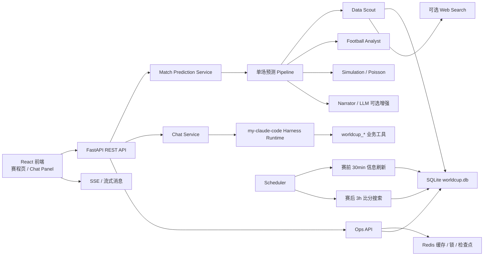

# WorldCup Agent

赛程驱动的世界杯单场预测与数据查询 Agent 系统。

当前版本已经从早期 demo 预测系统调整为以 SQLite 真实赛程数据为核心、以 `my-claude-code` harness 为主 Agent 编排层、以前端流式对话和赛程页为主要交互入口的应用。系统支持数据库查询、单场预测、赛前信息刷新、赛后比分搜索更新、Redis 检查点缓存、定时任务调度和运维接口。

## 核心能力

- 基于 SQLite 的 2026 世界杯球队、球员、赛程、比分数据管理。
- 世界杯赛程页按北京时间展示比赛日，已完赛场次显示数据库真实比分。
- 单场比赛预测工作流：数据搜查、球队分析、比分模拟、解释生成、结果保存。
- Chat Agent 支持流式输出，回答会逐字/分块显示在前端。
- `my-claude-code` harness 已接入后端，可作为主系统 Agent 调用业务工具。
- Data Scout 子 Agent 支持数据库检索，并可在配置搜索 Key 后联网搜索。
- 赛前 30 分钟定时刷新比赛相关新闻、阵容、伤病等信息。
- 比赛开始 3 小时后定时搜索比分结果，解析成功后写回数据库。
- Redis 用于热缓存、分布式锁、检查点加速；SQLite 仍保留持久化兜底。
- 运维接口支持 Redis 健康检查、调度器扫描、检查点恢复、数据库备份/恢复、Text2SQL 查询。

## 技术选型

| 层级 | 技术 |
| --- | --- |
| 前端 | React, TypeScript, Vite, Ant Design |
| 后端 | FastAPI, SSE, Pydantic |
| Agent 编排 | `backend/app/harness/my_claude_code`, 单场预测 Pipeline |
| 数据库 | SQLite, FTS5, WAL, 索引优化 |
| 缓存/锁 | Redis，可选启用 |
| 调度 | 后端内置 asyncio scheduler |
| 搜索 | 本地 SQLite 检索；可选 Bocha Web Search |
| LLM | OpenAI-compatible 接口，默认关闭，可配置 Qwen/DashScope |

## 架构概览



## 目录说明

```text
worldcup-champion-agent/
  backend/
    main.py                         # FastAPI 入口
    app/api/                        # REST / SSE / 运维路由
    app/core/                       # 配置、Redis、日志等基础设施
    app/harness/                    # my-claude-code harness 集成
    app/services/                   # 业务服务层
      chat_service.py               # 前端 Chat Agent 流式对话
      data_scout_service.py         # SQLite + 可选联网搜索
      match_prediction_service.py   # 赛程读取、单场预测、预测保存
      match_result_service.py       # 赛后比分搜索、解析、写库
      news_collection_service.py    # 赛前信息刷新
      scheduler_service.py          # 定时任务调度
      checkpoint_service.py         # Redis + SQLite 检查点
      text2sql_service.py           # 安全 Text2SQL 查询
      db_maintenance_service.py     # 备份、恢复、优化、完整性检查
    .env.example                    # 后端配置示例

  frontend/
    src/App.tsx                     # 主界面、赛程页、球队页、结果页
    src/components/ChatPanel.tsx    # 流式 Chat Agent 面板
    src/api/predictionApi.ts        # 前端 API 封装

  data/
    database.py                     # SQLite schema、索引、写入接口
    worldcup.db                     # 当前项目主数据库
    backups/                        # 数据库备份
    snapshots/                      # 单场预测快照

  datasets/                         # 静态 CSV 数据源
  data_agent/                       # 协作者数据接入与标准化模块
  scripts/                          # 数据构建、校验、导入脚本
  docker-compose.redis.yml          # 本地 Redis 容器配置
```

## 快速启动

后端推荐使用 `8001`，前端使用 `5173`。

```powershell
cd C:\Users\SJY\Desktop\worldcup-predict-agent-master\worldcup-champion-agent\backend
.venv\Scripts\python.exe -m uvicorn main:app --host 127.0.0.1 --port 8001
```

```powershell
cd C:\Users\SJY\Desktop\worldcup-predict-agent-master\worldcup-champion-agent\frontend
npm install
npm run dev -- --host 127.0.0.1 --port 5173
```

访问地址：

- 前端主页：http://127.0.0.1:5173/home
- 赛程页：http://127.0.0.1:5173/schedule
- 后端健康检查：http://127.0.0.1:8001/api/health

## Redis 配置

项目已经提供 `backend/.env.example` 和 `docker-compose.redis.yml`。本地开发推荐用 Docker 启动 Redis：

```powershell
cd C:\Users\SJY\Desktop\worldcup-predict-agent-master\worldcup-champion-agent
docker compose -f docker-compose.redis.yml up -d
docker exec worldcup-agent-redis redis-cli ping
```

看到 `PONG` 后，将 `backend/.env` 中 Redis 参数保持为：

```env
REDIS_ENABLED=true
REDIS_URL=redis://localhost:6379/0
REDIS_KEY_PREFIX=worldcup-agent
REDIS_DEFAULT_TTL_SECONDS=900
CHECKPOINT_TTL_SECONDS=86400
CHECKPOINT_RUNNING_TIMEOUT_SECONDS=1800
```

如果暂时没有 Redis，也可以设置：

```env
REDIS_ENABLED=false
```

此时检查点仍会写入 SQLite，只是缓存、锁和跨进程去重能力会降级。

## 关键配置

后端读取 `backend/.env`。常用配置如下：

```env
LLM_ENABLED=false
LLM_API_KEY=
LLM_BASE_URL=https://dashscope.aliyuncs.com/compatible-mode/v1
LLM_MODEL=qwen-plus

MY_CLAUDE_RUNTIME_ENABLED=true
BOCHA_API_KEY=

SCHEDULER_ENABLED=true
SCHEDULER_POLL_SECONDS=60
PRE_MATCH_UPDATE_MINUTES=30
PRE_MATCH_INCLUDE_WEB=false
POST_MATCH_RESULT_HOURS=3
POST_MATCH_INCLUDE_WEB=true
```

说明：

- `LLM_ENABLED=false` 时，系统优先使用本地规则和确定性逻辑。
- `BOCHA_API_KEY` 配置后，Data Scout 和赛后比分刷新可使用联网搜索。
- `PRE_MATCH_UPDATE_MINUTES=30` 表示每场比赛开始前 30 分钟刷新信息。
- `POST_MATCH_RESULT_HOURS=3` 表示每场比赛开赛 3 小时后搜索比分结果。

## 数据流

1. `datasets/*.csv` 和 `data_agent` 负责标准化协作者提供的数据。
2. `data/database.py` 初始化 `data/worldcup.db`，创建核心表、FTS 表和索引。
3. `match_prediction_service.py` 从 SQLite 读取赛程，统一转换为北京时间。
4. 前端调用 `/api/matches/schedule` 展示比赛日历。
5. 用户点击单场预测或在 Chat Agent 中询问比赛时，后端调用单场预测 Pipeline。
6. 预测结果保存到 `data/snapshots/match_predictions.json`。
7. 调度器定时触发赛前信息刷新和赛后比分更新，结果写回 SQLite。

## Agent 与 Harness

当前系统可以把整个后端看成一个主 Agent 系统：

- 主 Agent：`my-claude-code` harness runtime。
- 子 Agent / 工具层：
  - `worldcup_get_current_time`
  - `worldcup_list_teams`
  - `worldcup_list_matches`
  - `worldcup_search_database`
  - `worldcup_get_team_database_report`
  - `worldcup_predict_match_workflow`
  - `worldcup_get_saved_match_prediction`

Chat Agent 会优先处理明确的赛程、日期、时间类问题；一般问题则交给 harness/LLM 流程，并通过 SSE 流式返回给前端。

## 检查点与恢复

检查点用于避免重复执行定时任务，并支持失败恢复：

- Redis：热缓存和分布式锁。
- SQLite：持久化检查点，Redis 不可用时仍保留状态。
- `running` 检查点超过 `CHECKPOINT_RUNNING_TIMEOUT_SECONDS` 会被视为可恢复。
- `failed` 检查点允许下次重试。
- `completed` 检查点在 TTL 内默认跳过。

相关接口：

- `GET /api/ops/checkpoints`
- `GET /api/ops/checkpoints?status=failed`
- `POST /api/ops/checkpoints/recover-stale`
- `DELETE /api/ops/checkpoints/{name}`

## 主要 API

基础能力：

- `GET /api/health`
- `GET /api/teams`
- `GET /api/matches`
- `GET /api/matches/schedule`
- `GET /api/matches/{match_id}`
- `POST /api/matches/{match_id}/predict`
- `GET /api/matches/{match_id}/prediction`

Chat Agent：

- `POST /api/chat/sessions`
- `POST /api/chat/sessions/{session_id}/messages`
- `GET /api/chat/sessions/{session_id}/stream`

数据查询：

- `GET /api/data/search?q=...&include_web=false`
- `GET /api/data/teams/{team_name}`

运维接口：

- `GET /api/ops/redis/health`
- `GET /api/ops/scheduler/status`
- `POST /api/ops/scheduler/scan?force=false`
- `POST /api/ops/matches/{match_id}/result-refresh?force=true`
- `GET /api/ops/database/schema`
- `GET /api/ops/database/performance`
- `POST /api/ops/database/backup?label=manual`
- `GET /api/ops/database/backups`
- `POST /api/ops/database/restore?backup_name=...`
- `POST /api/ops/database/optimize`
- `GET /api/ops/database/integrity`
- `POST /api/ops/text2sql/query`

## 验证命令

后端编译检查：

```powershell
cd C:\Users\SJY\Desktop\worldcup-predict-agent-master
.\worldcup-champion-agent\backend\.venv\Scripts\python.exe -m compileall -q .\worldcup-champion-agent\backend\app .\worldcup-champion-agent\data .\worldcup-champion-agent\data_agent
```

前端类型检查：

```powershell
cd C:\Users\SJY\Desktop\worldcup-predict-agent-master\worldcup-champion-agent\frontend
node node_modules\typescript\bin\tsc --noEmit
```

Redis 健康检查：

```powershell
Invoke-RestMethod http://127.0.0.1:8001/api/ops/redis/health
```

## 当前注意事项

- 当前项目主数据源是 `data/worldcup.db`，不再回退旧 demo 赛制规则。
- 新数据出问题时应直接暴露错误，避免静默回退造成前端展示不一致。
- 赛后比分自动更新依赖联网搜索配置；未配置 `BOCHA_API_KEY` 时会记录失败检查点，等待后续重试。
- PowerShell 直接显示部分中文文件时可能出现乱码，这是终端编码显示问题；文件本身按 UTF-8 读写。
